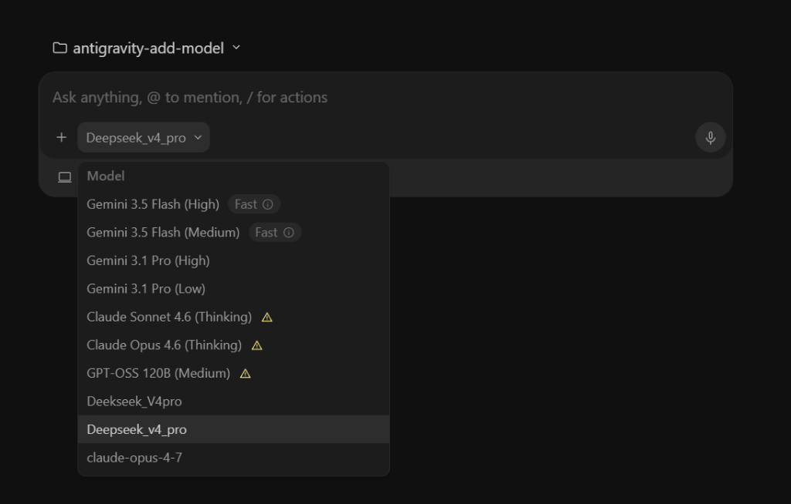
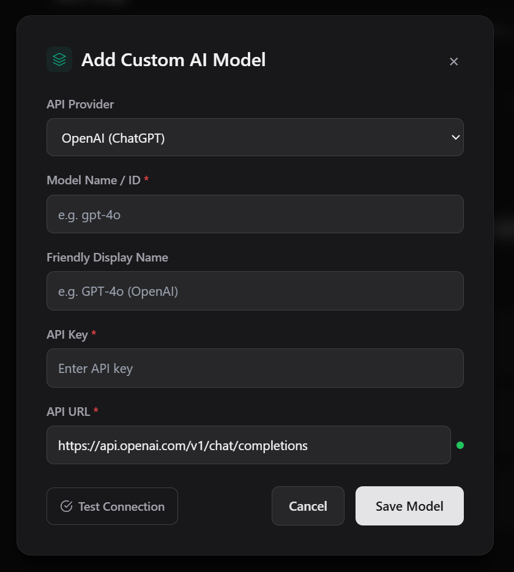
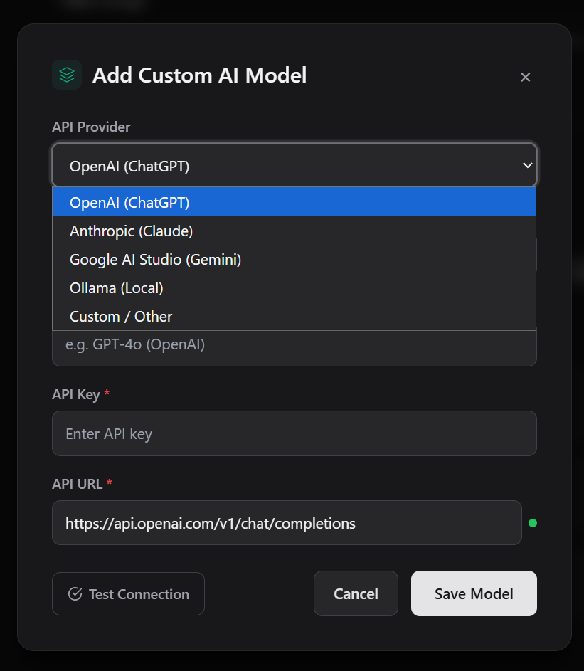
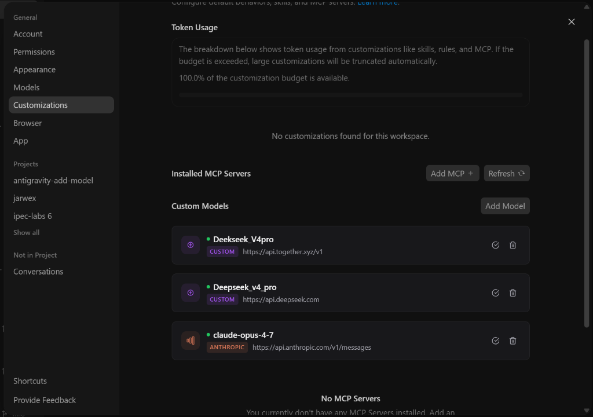

本方案只对反重力ide测试有效，反重力未测试，效果未知。

项目是在[vahapogut/antigravity-add-model](https://github.com/vahapogut/antigravity-add-model)基础上进行的修改。

# Antigravity 自定义模型启用器

> **Antigravity IDE（VS Code Fork）部署方案**
>
> 本仓库为 **Antigravity IDE 独立版**（解包式 `resources\app`，VS Code Fork 架构）提供一键部署，可在内置 Gemini 模型之外启用外部 AI 模型（OpenAI、Anthropic、Together API、Ollama、Google AI Studio 以及任何 OpenAI 兼容的提供商）。
>
> 它向 Electron 应用注入一个本地 HTTP 代理，逆向工程 Cloud Code 内部 API（`v1internal`），在各提供商格式之间翻译请求/响应，并通过 `custom_models.json` 配置实现外部模型无缝接入。

## 文档导航

| 文档 | 适用对象 | 内容 |
|---|---|---|
| **本 README** | 使用者 | 安装、配置、参数说明、安全机制、常见故障排查 |
| [ARCHITECTURE.md](./ARCHITECTURE.md) | 维护者 / 部署者 | **全景技术指南**：系统架构设计、内部 API 逆向规范、自动化部署、**9 个已踩坑与修复**、验证清单与回滚 |

---

## 快速开始

### 一键部署（Antigravity IDE）

```powershell
.\deploy-ide.ps1 -IdePath "C:\Users\<User>\AppData\Local\Programs\Antigravity IDE"
```

脚本自动完成：
1. 构建 TypeScript → `dist/`（`npm run build`）
2. 将 `main.js`、语言服务器二进制备份到 `resources\app_backup\`（含一键 `rollback.ps1`）
3. 将代理运行时文件部署到 `resources\app\out\proxy\` 并安装 `electron-log`
4. 在 `out\main.js` 顶部注入 ESM 动态 `import('./proxy/bootstrap.js')`
5. 写入 `jetski.cloudCodeUrl` → 本地代理 URL（幂等，代理启动时自动校正为实际端口）
6. （可选）对语言服务器二进制打补丁 — 用 `-SkipBinaryPatch` 跳过（此架构下非必需）
7. 启动 IDE 并进行健康检查

> [!TIP]
> IDE 采用解包式 `resources\app\` 布局（无 `app.asar`）。语言服务器的云端端点由 **`jetski.cloudCodeUrl`** 用户设置驱动，它会覆盖二进制内的硬编码 URL — 因此写入该设置是关键步骤。完整技术实现与 9 个已知坑见 [ARCHITECTURE.md](./ARCHITECTURE.md)。

### 从源码构建（TypeScript）

```bash
npm install
npx tsc
```

---

## 支持的提供商

你可以**同时配置来自不同提供商的多个模型**。它们会一并出现在 Antigravity 聊天界面的模型选择下拉列表中，可实时切换。

<p align="center">
  
</p>

| 提供商 | 格式 | 环境变量 / 密钥 | 默认 API URL |
|---|---|---|---|
| **OpenAI** | `openai` | `apiKey`（或 `OPENAI_API_KEY`） | `https://api.openai.com/v1/chat/completions` |
| **Anthropic** | `anthropic` | `apiKey`（或 `ANTHROPIC_API_KEY`） | `https://api.anthropic.com/v1/messages` |
| **OpenRouter** | `openrouter` | `apiKey`（OpenRouter API 密钥） | `https://openrouter.ai/api/v1/chat/completions` |
| **Ollama**（本地） | `ollama` | *（无需）* | `http://localhost:11434/v1/chat/completions` |
| **Google AI Studio** | `google` | `apiKey` *（Gemini API 密钥）* | `https://generativelanguage.googleapis.com/v1beta/models/gemini-pro:generateContent` |
| **DeepSeek** | `deepseek` | `apiKey` | `https://api.deepseek.com/anthropic` |
| **Groq** | `groq` | `apiKey` | `https://api.groq.com/openai/v1` |
| **Mistral** | `mistral` | `apiKey` | `https://api.mistral.ai/v1` |
| **Cerebras** | `cerebras` | `apiKey` | `https://api.cerebras.ai/v1` |
| **Kimi（Moonshot）** | `kimi` | `apiKey` | `https://api.moonshot.ai/anthropic/v1` |
| **Fireworks AI** | `fireworks` | `apiKey` | `https://api.fireworks.ai/inference/v1` |
| **LM Studio**（本地） | `lmstudio` | *（无需）* | `http://localhost:1234/v1` |
| **llama.cpp**（本地） | `llamacpp` | *（无需）* | `http://localhost:8080/v1` |
| **NVIDIA NIM** | `nvidia` | `apiKey` | `https://integrate.api.nvidia.com/v1` |
| **自定义**（OpenAI 兼容） | `custom` 或 `openai` | `apiKey` *（提供商 API 密钥）* | 任意 OpenAI 兼容端点 |

> [!IMPORTANT]
> **第三方模型平台（商汤 SenseNova、硅基流动 SiliconFlow、阿里百炼 DashScope、智谱 AI 等）配置须知**：
> 在 `custom_models.json` 中，`provider` 字段指的是**协议翻译器类型**，而非厂商品牌名。只要平台提供的是标准 OpenAI 兼容的 `/v1/chat/completions` 接口，`provider` **必须填写 `"openai"` 或 `"custom"`**，切勿填写 `"SenseNova"` 等自定义名称，否则代理将无法识别协议类型并导致请求透传报错 400（详见 [ARCHITECTURE.md](./ARCHITECTURE.md) 坑 9）。

> [!NOTE]
> 对于**自定义**提供商，以 `/v1` 结尾的 URL 会自动追加 `/chat/completions`。它与 Together AI、OpenRouter、Groq、Mistral 及任何其他 OpenAI 兼容端点完全兼容。

> [!NOTE]
> **OpenRouter** 通过单一 API 提供对 300+ 模型（OpenAI、Anthropic、Google、Meta、DeepSeek 等）的统一访问。它使用 OpenAI 兼容格式，带 Bearer token 鉴权，并可选 `HTTP-Referer` / `X-Title` 头用于排名。

> [!NOTE]
> 对于 **Google AI Studio**，提供完整端点 URL 或仅基础 `https://generativelanguage.googleapis.com/v1beta/models/`。代理根据请求是否为流式自动判断 `streamGenerateContent` 还是 `generateContent`。

> [!NOTE]
> **多模态 / 视觉（Vision）支持**：代理会将聊天中粘贴、或 Agent 自动截图并发送的图像（Gemini 的 `inlineData` 图像 part）正确翻译为目标提供商的标准结构 — OpenAI 的 `image_url` 内容块、Anthropic 的 `type: "image"` 内容块，使 GPT-4o、Claude 3.5 Sonnet 等视觉模型真正“看见”图像（而非退化为 `[Image: data:...]` 占位文本）。能否解码图像仍取决于所用模型本身是否支持视觉。

---

## 配置

模型存储在用户主目录的 `~/.gemini/antigravity/custom_models.json`。可通过设置中的**“添加模型”**弹窗轻松添加，也可直接编辑该 JSON 文件。

以下是一个**同时配置所有提供商多个模型**的 `custom_models.json` 完整示例：

```json
{
  "models": [
    {
      "name": "models/gpt-4o",
      "displayName": "GPT-4o (OpenAI)",
      "description": "经官方 API 的 OpenAI GPT-4o 模型",
      "provider": "openai",
      "apiKey": "sk-proj-...",
      "apiUrl": "https://api.openai.com/v1/chat/completions",
      "externalModelName": "gpt-4o"
    },
    {
      "name": "models/claude-3-5-sonnet",
      "displayName": "Claude 3.5 Sonnet",
      "description": "经官方 API 的 Anthropic Claude 3.5 Sonnet",
      "provider": "anthropic",
      "apiKey": "sk-ant-...",
      "apiUrl": "https://api.anthropic.com/v1/messages",
      "externalModelName": "claude-3-5-sonnet-latest"
    },
    {
      "name": "models/gemini-1.5-pro",
      "displayName": "Gemini 1.5 Pro (AI Studio)",
      "description": "经 Google AI Studio 密钥的 Gemini 1.5 Pro",
      "provider": "google",
      "apiKey": "AIzaSy...",
      "apiUrl": "https://generativelanguage.googleapis.com/v1beta/models/gemini-1.5-pro:generateContent",
      "externalModelName": "gemini-1.5-pro"
    },
    {
      "name": "models/llama3",
      "displayName": "Llama 3 (本地 Ollama)",
      "description": "运行在 Ollama 11434 端口的本地 Llama 3 模型",
      "provider": "ollama",
      "apiKey": "",
      "apiUrl": "http://localhost:11434/v1/chat/completions",
      "externalModelName": "llama3"
    },
    {
      "name": "models/deepseek-ai/deepseek-v4-pro",
      "displayName": "DeepSeek V4 Pro (Together)",
      "description": "经 Together API 的 DeepSeek V4 Pro",
      "provider": "custom",
      "apiKey": "YOUR_TOGETHER_API_KEY",
      "apiUrl": "https://api.together.xyz/v1",
      "externalModelName": "deepseek-ai/DeepSeek-V4-Pro",
      "maxRetries": 3
    }
  ]
}
```

### 字段说明

| 字段 | 说明 |
|---|---|
| `name` | 内部模型标识符（如 `models/gpt-4o`）。必须以 `models/` 前缀开头。 |
| `displayName` | 将出现在 Antigravity 聊天模型下拉列表中的友好名称。 |
| `description` | 设置中自定义模型列表里展示的副标题/描述。 |
| `provider` | `openai`、`anthropic`、`openrouter`、`ollama`、`google` 或 `custom` 之一。决定请求与响应格式的翻译方式。 |
| `apiKey` | 提供商的 API 凭证。本地提供商（如 Ollama）留空 `""`。 |
| `apiUrl` | 目标端点。会根据 UI 下拉选择自动预填。 |
| `externalModelName` | 目标提供商所期望的精确模型 ID（如 `gpt-4o`、`claude-3-5-sonnet-latest`、`llama3`）。 |
| `allowUnauthorized` | （可选）设为 `true` 可跳过 SSL 证书校验。适用于内部/自签名端点。默认：`false`。 |
| `timeout` | （可选）请求超时（毫秒）。默认：`120000`（2 分钟）。 |
| `maxRetries` | （可选）限流/失败请求的最大重试次数。默认：`3`。 |

---

## UI 功能

### 添加模型弹窗

点击设置 → 模型中的**“添加模型”**按钮，打开一个精致弹窗，包含：
- 提供商下拉（OpenAI、Anthropic、Google AI Studio、Ollama、OpenRouter、自定义）
- 根据所选提供商自动预填 URL
- 输入模型 ID 时动态生成 Google AI Studio URL
- 带背景模糊的平滑进入/退出动画
- 表单校验（必填：模型 ID、API 密钥、API URL）
- 留空时自动生成展示名称

<p align="center">
  
  
</p>

### 自定义模型面板

在设置 → 模型中，MCP 区块下方有一个“自定义模型”区，展示所有已配置模型，包含：
- 模型名称与提供商/URL 详情
- **测试连接**按钮，带绿色 ✅ / 红色 ❌ 状态指示
- 列表项悬停效果
- 带确认对话框的删除按钮
- 未配置任何模型时的空状态占位
- 添加/删除操作后自动刷新
- **高效 DOM 监听**：使用 `MutationObserver` 加 200ms 防抖，替代 `setInterval(1000ms)`，大幅降低 CPU 开销。注入成功后观察器自动断开，并在 SPA 页面切换时通过 URL 变化检测重新挂载。

<p align="center">
  
</p>

### SSL 跳过（自签名 / 内部 CA）

对于使用自签名证书或内部 CA 的企业环境（如企业代理服务器、私有 API 端点），在模型配置中加入 `"allowUnauthorized": true`：

```json
{
  "name": "models/internal-model",
  "displayName": "内部 LLM（企业）",
  "description": "自签名证书后的公司托管模型",
  "provider": "custom",
  "apiKey": "...",
  "apiUrl": "https://llm.internal.company.com/v1",
  "externalModelName": "llama3",
  "allowUnauthorized": true
}
```

> [!WARNING]
> 启用 `allowUnauthorized` 时会在控制台记录一条警告。SSL 跳过**仅**作用于该特定模型，从不全局生效。

---

## 安全考量

> [!WARNING]
> **API 密钥安全**：所有 API 密钥通过 Electron `safeStorage` 以 AES-256-GCM 静态加密（macOS Keychain / Windows DPAPI）。切勿分享你的 `custom_models.json` 文件，或在日志中暴露 API 密钥。

> [!CAUTION]
> **SSL 校验**：`allowUnauthorized: true` 选项会禁用 TLS 证书校验。仅用于受信任的内部/自签名端点。对公开 API 连接启用它会让你暴露于中间人攻击。

### 安全默认值

- **超时**：自定义模型 API 请求默认超时 120 秒（可通过 `timeout` 字段配置）。Google 代理请求超时 30-60 秒。
- **请求体大小限制**：请求体上限 10MB 以防内存耗尽。超限返回 `413 Payload Too Large`。
- **无诊断泄漏**：原始 API 响应从不落盘。CSRF token 在控制台输出中掩码。
- **掩码密钥**：UI 中 API 密钥以 `sk-...XXXX`（仅末 4 位）展示。
- **托管状态**：代理清理间隔在关停时被正确停止，避免遗留定时器。

---

## Antigravity 更新恢复

### 问题

自 **Antigravity v2.0.6** 起，语言服务器的 `fetchAvailableModels` 调用指向 `https://daily-cloudcode-pa.googleapis.com/v1internal:fetchAvailableModels`。若不拦截，自定义模型不会出现在聊天下拉列表中 — 只有 Google 内置的 Gemini 模型。

### 修复（IDE 架构）

在 **Antigravity IDE（VS Code Fork）** 架构下，语言服务器从用户设置 **`jetski.cloudCodeUrl`** 读取云端端点，并通过 `--cloud_code_endpoint` 传入。这会**覆盖**二进制内的硬编码 URL，因此二进制补丁在此**非必需**。`deploy-ide.ps1` 写入：

```json
"jetski.cloudCodeUrl": "http://127.0.0.1:50999/v1internal/xxxxxxx"
```

将全部 Cloud Code 流量导向本地代理是安全的 — 未被拦截的请求会透传到官方端点。`/v1internal/xxxxxxx` 填充由代理在转发给 Google 前剥离。

### 每次 IDE 更新后

Antigravity IDE 自动更新会覆盖已注入的文件（`out\main.js`、`out\proxy\`、可选的 LS 二进制）。重跑部署脚本即可全部恢复：

```powershell
.\deploy-ide.ps1 -IdePath "C:\Users\<User>\AppData\Local\Programs\Antigravity IDE"
```

> [!IMPORTANT]
> `settings.json`（`jetski.cloudCodeUrl`）与 `custom_models.json` 在更新后不受影响，因此只需重新注入文件。

---

## 故障排查

### 端口冲突
若端口 `50999` 被占用，代理自动回退到随机端口，并**自动同步**：
- 将实际端口写入 `~/.gemini/antigravity/active_port`；
- 将用户 `settings.json` 中的 `jetski.cloudCodeUrl` 精确更新为 `http://127.0.0.1:<actual_port>/v1internal/xxxxxxx`（保留你的注释与排版），确保 Language Server 始终连接到代理实际监听端口，无需手动修改。端口恢复为 `50999` 时也会自动同步回来。

### 语言服务器崩溃
60 秒内最多自动重启 3 次。查看日志：
- **Windows**：`%LOCALAPPDATA%\antigravity\logs\`
- **macOS**：`~/Library/Logs/antigravity/`

### SSL/TLS 错误
1. 确认提供商证书有效
2. 作为最后手段，在模型配置中加入 `"allowUnauthorized": true`
3. 对于内部 CA，将 CA 证书安装到系统信任存储

### 模型未出现
1. 确认模型名称以 `models/` 开头
2. 检查 `apiUrl` 是否正确
3. 添加模型后重启 Antigravity
4. 用**测试连接**按钮验证端点可达性
5. 若界面显示的模型比配置数量少 1 个以上：多为**同名 slug 覆写**（两个模型 `externalModelName` 相同），已由 `toSlug()` 按 `displayName` 优先解决（见 ARCHITECTURE 文档“坑 10”）。
6. 若模型已注入配置齐全但仍超过约 10 项显示不全：为前端 `max-h-80`（320px）高度截断，需确保 `deploy-ide.ps1` 第 6 步的 workbench 高度/滚动补丁已生效（IDE 更新会使其失效），重跑部署即可。
7. 若模型显示名称含 `flash`/`lite`/`low`/`medium`/`high`/`pro`/`tier` 等分级词汇，可能被前端过滤，请改名后重试

### 连接超时
1. 检查提供商 API 是否可达（`curl -I <apiUrl>`）
2. 调大模型配置中的 `timeout`（如 `"timeout": 180000` 表示 3 分钟）
3. 核查网络/代理/VPN 设置

### 限流（429）
代理自动以指数退避最多重试 3 次。若仍出现限流错误：
1. 降低请求频率
2. 调大模型配置中的 `maxRetries`
3. 查看你的 API 提供商限流面板

> 更多深层排障（如 LS 崩溃、协议 400、登录卡死等）见 [ARCHITECTURE.md](./ARCHITECTURE.md) 的“踩坑实录与深度排障”与“关键日志位置速查”。

---

## 贡献

欢迎提交 Pull Request。请确保：
1. 代码遵循既有风格（JSDoc 注释、一致的错误处理）
2. 新增提供商翻译器同时包含请求与响应映射
3. 安全敏感代码避免 `eval`、明文密钥日志、不当的 SSL 处理
4. TypeScript 可干净编译：`npx tsc --noEmit`

> 开发与架构细节（协议翻译、流式、Schema 校验、添加新提供商指南）见 [ARCHITECTURE.md](./ARCHITECTURE.md)。

---

## 许可证

Apache License 2.0。详见 [LICENSE](LICENSE)。

---

## 开发者

**Abdulvahap OGUT**

[](https://www.linkedin.com/in/abdulvahap-ogut-343992398/)
